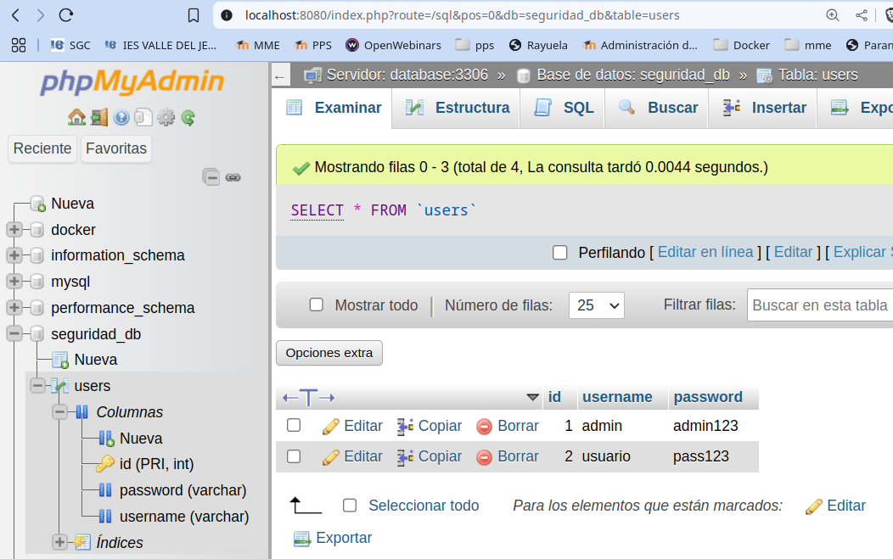
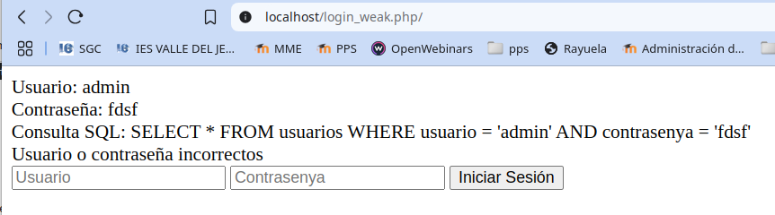
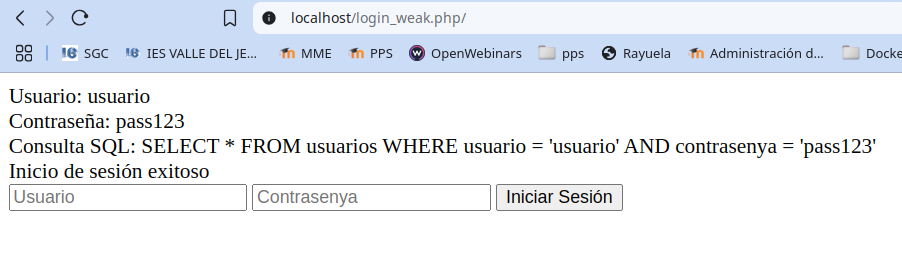
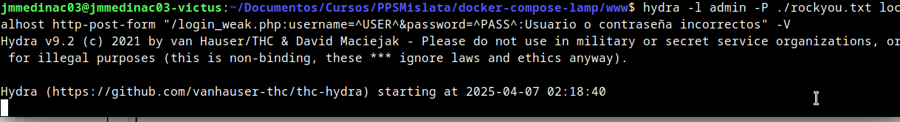
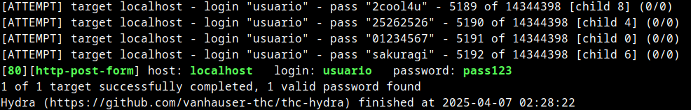
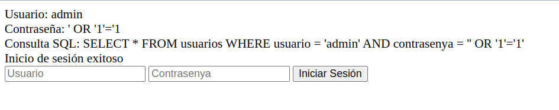
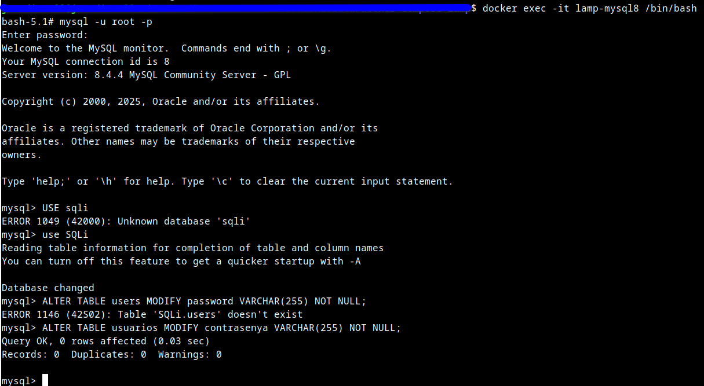
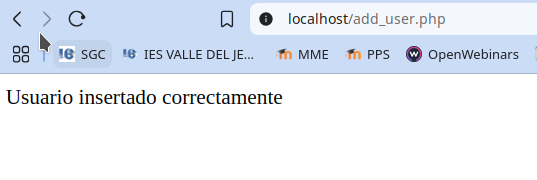
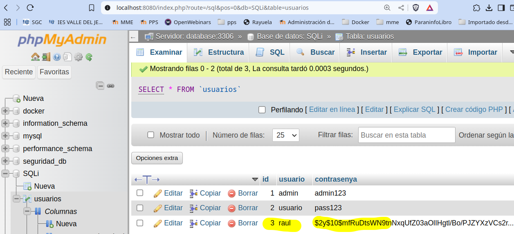
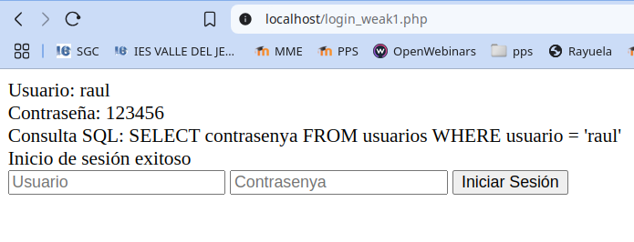

# PPS-Unidad3Actividad12-Broken Authentication
Explotación y Mitigación de Broken Authenticatión().
Tenemos como objetivo:

> - Ver cómo se pueden hacer ataques autenticación.
>
> - Analizar el código de la aplicación que permite ataques de autenticación débil.
>
> - Implementar diferentes modificaciones del codigo para aplicar mitigaciones o soluciones.

## ¿Qué es la Autenticación débil?
---

Algunos sitios web ofrecen un proceso de registro de usuarios que automatiza (o semiautoma) el aprovisionamiento del acceso del sistema a los usuarios. Los requisitos de identidad para el acceso varían de una identificación positiva a ninguna, dependiendo de los requisitos de seguridad del sistema. Muchas aplicaciones públicas automatizan completamente el proceso de registro y aprovisionamiento porque el tamaño de la base de usuarios hace que sea imposible administrar manualmente. Sin embargo, muchas aplicaciones corporativas aprovisionarán a los usuarios manualmente, por lo que este caso de prueba puede no aplicarse.

Esto puede incluir credenciales débiles, almacenamiento inseguro de contraseñas, gestión inadecuada de sesiones y falta de protección contra ataques de fuerza bruta.

**Consecuencias de Autenticación débil:**
- Descubrimiento de credenciales de usuario.
- Ejecución de ataques de suplantación de usuarios. 

 
## ACTIVIDADES A REALIZAR
---
> Lee detenidamente la sección de vulnerabilidades de subida de archivos.  de la página de PortWigger <https://portswigger.net/web-security/authentication>
>
> Lee el siguiente [documento sobre Explotación y Mitigación de ataques de Remote Code Execution](./files/ExplotacionYMitigacionBrokenAuthentication.pdf>
> 
> También y como marco de referencia, tienes [ la sección de correspondiente de los Procesos de Registros de Usuarios del  **Proyecto Web Security Testing Guide** (WSTG) del proyecto **OWASP**.](https://owasp.org/www-project-web-security-testing-guide/stable/4-Web_Application_Security_Testing/03-Identity_Management_Testing/02-Test_User_Registration_Process)>

Vamos realizando operaciones:

## Operaciones previas
---
Antes de comenzar tenemos que realizar varias operaciones previas:

- Comprobar la base de datos con la que vamos a trabajar:
	- Para esta actividad tenemos una base de datos con nombre usuarios, con campos id, usuario, contrasenya.

- Descargar el diccionario de contraseñas con el que vamos a realizar un ataque de fuerza bruta.

 
### Creación de la Base de Datos
---

Para realizar esta actividad necesitamos acceder a una Base de datos con usuarios y contraseñas. Si ya la has creado en la actividad de Explotación y mitigación de ataques de inyección SQL, no es necesario que la crees de nuevo. Si no la has creado, puedes verlo en <https://github.com/jmmedinac03vjp/PPS-Unidad3Actividad4-InyeccionSQL> en la sección de Creación de Base de datos.

Crea la tabla de usuarios. Debería de mostrarte algó así al acceder a:

~~~
http://localhost:8080
~~~

### Instalar **hydra** en tu equipos.

Vamos a realizar un ataque de fuerza bruta para intentar recuperar las contraseñas. Esto lo haremos con el malware **hydra**

Si tu equipo es Linux, puedes instalarlo con:

~~~
sudo apt install hydra
~~~

Si tienes Windows puedes descargarlo desde la página del desarrollador: <https://www.incibe.es/servicio-antibotnet/info/Hydra>

### Descargar el diccionario de contraseñas

Podemos encontrar muchos archivos de contraseñas. Vamos a utilizar el que se encuentra en la siguiente dirección:
 <https://weakpass.com/download/90/rockyou.txt.gz>

Lo descargarmos dentro de **nuestro equipo, con el que vamos a simular serr nosotros un atacante**,y una vez descargado, lo colocamos en el directorio que deseemos, descargamos con wget y descomprimimos el archivo. En el caso de que utilizemos Linux:

~~~
cd /usr/share
wget https://weakpass.com/download/90/rockyou.txt.gz
gunzip rockyou.txt.gz
~~~

## Código vulnerable
---

El código contiene varias vulnerabilidades que pueden ser explotadas para realizar ataques de autenticación rota.

Crear al archivo **login_weak.php** con el siguiente contenido (tencuidado de sustituír **mi_password** por la contraseña de root de tu BBDD:

~~~
<?php
// creamos la conexión 
$conn = new mysqli("database", "root", "josemi", "SQLi");

if ($conn->connect_error) {
        // Excepción si nos da error de conexión
        die("Error de conexión: " . $conn->connect_error);
}
if ($_SERVER["REQUEST_METHOD"] == "POST" || $_SERVER["REQUEST_METHOD"] == "GET") {
        // Recogemos los datos pasados
        $username = $_REQUEST["username"];
        $password = $_REQUEST["password"];

        print("Usuario: " . $username . " ");
        print("Contraseña: " . $password . " ");

        // preparamos la consulta
        $query = "SELECT * FROM usuarios WHERE usuario = '$username' AND contrasenya = '$password'";
        print("Consulta SQL: " . $query . " ");

        //realizamos la consulta y recogemos los resultados
        $result = $conn->query($query);
        if ($result->num_rows > 0) {
        echo "Inicio de sesión exitoso";
        } else {
                echo "Usuario o contraseña incorrectos";
        }
}
$conn->close();

?>
<form method="post">
        <input type="text" name="username" placeholder="Usuario">
        <input type="password" name="password" placeholder="Contrasenya">
        <button type="submit">Iniciar Sesión</button>
</form>
~~~
Antes de acceder la página web, asegurarse de que el servicio está en ejecución, y si es necesario, arrancar o reiniciar el servicio.

Acceder a la pagina web aunque también podemos poner directamente el usuario y contraseña. Un ejemplo es  el siguiente enlace:

~~~
http://localhost/login_weak.php?username=admin&password=123456
~~~

Vemos que si los datos son incorrectos nos muestra que no lo es:

Y si es correcta nos lo indica:

**Vulnerabilidades del código:**
1. Inyección SQL: La consulta SQL usa variables sin validación, lo que permite ataques de inyección.

2. Uso de contraseñas en texto plano: No se usa hashing para almacenar las contraseñas, lo que facilita su robo en caso de acceso a la base de datos.

3. Falta de control de intentos de inicio de sesión: No hay mecanismos de protección contra ataques de fuerza bruta.

4. Falta de gestión segura de sesiones: No se generan tokens de sesión seguros tras un inicio de sesión exitoso.

## Explotación de vulnerabilidades de Autenticación Débil

Si el usuario root de MySQL no tiene una contraseña asignada, estableced una para evitar posibles inconvenientes al trabajar con MySQL.

### Ataque de fuerza bruta con Hydra

Si el sistema no tiene un límite de intentos fallidos, se puede usar Hydra para adivinar contraseñas:

Hydra es un malware de tipo troyano bancario que se enfoca en infectar dispositivos Android para robar credenciales bancarias. Además, proporciona una puerta trasera a los atacantes que permite incluir el dispositivo como parte de una botnet y realizar otras actividades maliciosas.

En esta ocasión vamos a simular ser los atacantes y vamos a hacer un ataque de fuerza bruta con Hydra. Intentaremos acceder con todos los usuarios y las contraseñas incluidas en el diccionario rockyou.txt que hemos descargado anteriormente. 

Recordamos que seremos nosotros los atacantes, por eso desde nuestro equipo anfitrión, donde hemos descargado hydra y el diccionario, ejecutamos:

~~~
hydra -l admin -P /usr/share/rockyou.txt localhost http-post-form "/login_weak.php:username=^USER^&password=^PASS^:Usuario o contraseña incorrectos" -V
~~~

Explicación de los parámetros:

• -l el usuario con el que vamos a probar el login. 

• http-post-form: Indica que estás atacando un formulario de autenticación con método POST.

• "/login_weak.php:username=^USER^&password=^PASS^:Fallo":

	- /login_weak.php → Ruta de la página de inicio de sesión.

	- username=^USER^&password=^PASS^ → Parámetros que se envían en la solicitud POST. Hydra reemplazará ^USER^ y ^PASS^ con los valores de la lista de usuarios y contraseñas.

	- Fallo → Texto que aparece en la respuesta cuando el inicio de sesión falla. Se puede cambiar por el mensaje real de error que muestra la página cuando una contraseña es incorrecta (por ejemplo, "Usuario o contraseña incorrectos").
---

Aquí podemos ver cómo lanzamos el comando:

Si encontramos un resultado correcto de autenticación, vemos como nos lo muestra:

## Explotación de SQL Injection
---

Cómo ya vimos en la actividad de Inyección de SQL, el atacante puede intentar un payload malicioso en el campo de contraseña:

~~~
username: admin
password: ' OR '1'='1
~~~

Esto convertiría la consulta en:

~~~
SELECT * FROM users WHERE username = 'admin' AND password = '' OR '1'='1';
~~~

Debido a que '1'='1' es siempre verdadero, el atacante obtendría acceso.

## Mitigación: Código Seguro en PHP
---

**Uso de contraseñas cifradas con password_hash**
---

La primera aproximación es no guardar las contraseñas en texto, sino aplicarle encriptación o hash que lo hemos visto ya en los contenidos teóricos.

Para almacenar las contraseñas hasheadas, deberemos de modificar la tabla donde guardamos los usuarios, por lo que tenemos que realizar varias operaciones:

> **Modificamos la tabla de contraseñas de la BBDD**
>
> Ejecutamos la consulta sobre la BBDD 
>
> Recuerda que:
>
> - Accedemos al contenedor de la BBDD:
>
~~~
 docker exec -it lamp-mysql8 /bin/bash
~~~
>
> - Nos conectamos a la Base de Datos como usuario root con mysql y despues ejecutar la consulta).
>
~~~
 mysql -u root -p
~~~
>
> - Y seleccionamos la BBDD y modificamos la tabla:
>
~~~
 USE usuarios
 ALTER TABLE usuarios MODIFY contrasenya VARCHAR(255) NOT NULL; 
~~~
>

>Creamos la función **ạdd_users.php** para introducir los usuarios con su contraseña hasheada (Acuérdate de cambiar MiContraseña por la tuya de root):

~~~
<?php
error_reporting(E_ALL);
ini_set('display_errors',1);
// Conexión a la base de datos
$conn = new mysqli("database", "root", "MiContraseña", "SQLi");
if ($conn->connect_error) {
die("Conexión fallida: " . $conn->connect_error);
}
// Usuario de prueba
$usuario = "raul";
$contrasenya = "123456";
$hashed_password = password_hash($contrasenya, PASSWORD_DEFAULT);
// Inserción
$stmt = $conn->prepare("INSERT INTO usuarios (usuario, contrasenya) VALUES (?,?)");
$stmt->bind_param("ss", $usuario, $hashed_password);
if ($stmt->execute()) {
echo "Usuario insertado correctamente";
} else {
echo "Error al insertar usuario: " . $stmt->error;
}
$stmt->close();
$conn->close();
?>
~~~

En la función **pasword_hash()"** utilizamos la función por defecto: **PASSWORD_DEFAULT** que usa actualmente **BCRYPT**, pero se actualizará automáticamente en versiones futuras de PHP. Si deseas más control, puedes usar **PASSWORD_BCRYPT** o **PASSWORD_ARGON2ID**.

>Como vemos, una vez ejecutado nos informa que el usuario raul con contraseña 123456 ha sido insertado.
>
>

 Lo podemos ver accediendo al servicio phpmyadmin: `http://localhost:8080`

 También puedes obtener los usuarios conectandote a la base de datos y ejecutando la consulta:

 ~~~
SELECT * from usuarios
~~~

La función **password_hash()** con **PASSWORD_BCRYPT** genera un hash de hasta 60 caracteres, y con
PASSWORD_ARGON2ID, incluso más (hasta 255). Por eso, se necesita que la columna pueda almacenarlos
adecuadamente.

Aplicando mitigaciones de uso de contraseñas con password_hash tendríamos el siguiente archivo: **login_weak1.php**:
(Recuerda que tienes que cambiar miContraseña por tu contraseña de root)
~~~
<?php
// creamos la conexión 
$conn = new mysqli("database", "root", "josemi", "SQLi");

if ($conn->connect_error) {
        // Excepción si nos da error de conexión
        die("Error de conexión: " . $conn->connect_error);
}
if ($_SERVER["REQUEST_METHOD"] == "POST" || $_SERVER["REQUEST_METHOD"] == "GET") {
        // Recogemos los datos pasados
        $username = $_REQUEST["username"];
        $password = $_REQUEST["password"];

        print("Usuario: " . $username . " ");
        print("Contraseña: " . $password . " ");

        // NO PREVENIMOS SQL INJECTION, SOLO SE AGREGA PASSWORD_HASH
        $query = "SELECT contrasenya FROM usuarios WHERE usuario = '$username'";
        print("Consulta SQL: " . $query . " ");

        //realizamos la consulta y recogemos los resultados
        $result = $conn->query($query);
        if ($result->num_rows > 0) {
                $row = $result->fetch_assoc();
                $hashed_password = $row["contrasenya"];
                // Verificación de contraseña hasheada
                if (password_verify($password, $hashed_password)) {
                        echo "Inicio de sesión exitoso";
                } else {
                        echo "Usuario o contraseña incorrectos";
                }
        } else {
                echo "Usuario no encontrado";
        }
}
$conn->close();

?>
<form method="post">
        <input type="text" name="username" placeholder="Usuario">
        <input type="password" name="password" placeholder="Contrasenya">
        <button type="submit">Iniciar Sesión</button>
</form>
~~~

Como vemos en la siguiente imagen nos da un login exitoso:

También puedes probar a usuarlos introduciendo en el navegador:

~~~
http://localhost/login_weak1.php?username=raul&password=123456
~~~

Si introducimos datos no correcto dará el mensaje de "Usuario o contraseña no correctos"

~~~
http://localhost/login_weak1.php?username=raul&password=1234
~~~

>
>
>
>
>
>
>
>
>
>
>
>
>
<

---

### **Código seguro**
---

Aquí está el código securizado:

🔒 Medidas de seguridad implementadas

- :

        - 

        - 

🚀 Resultado

✔ 

✔ 

✔ 

## ENTREGA

> __Realiza las operaciones indicadas__

> __Crea un repositorio  con nombre PPS-Unidad3Actividad6-Tu-Nombre donde documentes la realización de ellos.__

> No te olvides de documentarlo convenientemente con explicaciones, capturas de pantalla, etc.

> __Sube a la plataforma, tanto el repositorio comprimido como la dirección https a tu repositorio de Github.__

